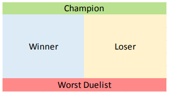

# Duelist-Algorithm-Python
A Python implementation of the paper : 
Duelist Algorithm: An Algorithm Inspired by How Duelist Improve Their Capabilities in a Duel (2015)
Totok Ruki Biyanto, Henokh Yernias Fibrianto, Gunawan Nugroho, Erny Listijorini, Titik Budiati, Hairul Huda
https://arxiv.org/abs/1512.00708

I would like to clarify that various figures of this README.md document is taken from the original artical as shown above.

# Theory (From Biyanto et al., 2015)
Duelist Algorithm is a metaheuristic for mathematical optimization problems. Metaheuristic are a higher-level procedure or heuristic designed to find, generate, or select a heuristic (partial search algorithm) that may provide a sufficiently good solution to an optimization problem, especially with incomplete or imperfect information or limited computation capacity. Examples for metaheuristics include genetic algorithm, particle swarm optimization, etc. Many of these metaheuristics rely on population-based search, which utilizes many "searchers" (also refered to as "particles" or "swarms") to simultaneously search the solution space.

The procedure of Duelist Algorithm is shown in the figure below. Quoting from the authors:
>The Duelist Algorithm starts with an initial set of duelists. The duel is to determine the winner and loser. The loser learns from the winner, while the winner try their new skill or technique that may improve their fighting capabilities. A few duelists with highest fighting capabilities are called as champion. The champion train a new duelists such as their capabilities. The new duelist will join the tournament as a representative of each champion. All duelist are re-evaluated, and the duelists with worst fighting capabilities is eliminated to maintain the amount of duelists. 

In the Duelist Algorithm, the best solutions in a population are chosen as the champions, while worst solutions are eliminated. Winner mutates themselves and attempts to improve, while losers learns from winner (has a chance to copy traits of winner).

In the original paper, Duelist Algorithm was shown to out-perform a few state-of-art metaheuristic algorithm for some specific tasks. Therefore, it is very interesting.

